# app-openfoam

Ubuntu-based desktop with [OpenFOAM](https://cfd.direct/openfoam/) open
source CFD software with **paraFOAM** for visualization and post-processing.

## Configuration
https://cfd.direct/openfoam/user-guide/v0-running-applications-parallel/

## Usage
https://cfd.direct/openfoam/user-guide/

## How to Setup and Run an OpenFOAM Project in Interactive Mode using Nimbix

This article describes the workflow and settings/considerations to set-up
and run an OpenFOAM project on Linux using the Nimbix cloud.

**NOTE**: This example uses the “simplefoam motorbike” OpenFOAM tutorial.

### Launching an OpenFOAM Job

To access OpenFOAM on Nimbix platform, the following steps are required:

1. Select OpenFOAM release from the Compute dashboard.

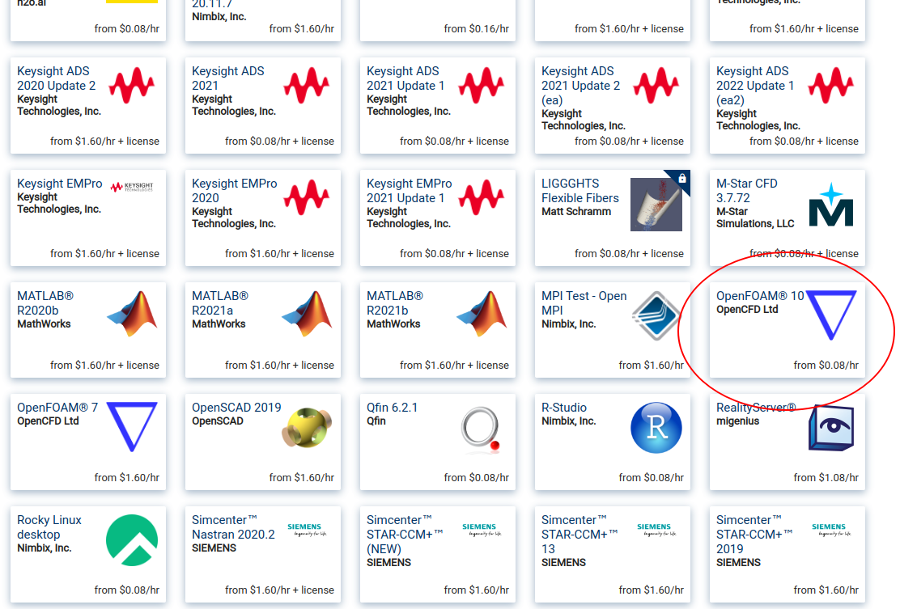

**NOTE**: If the option is not available in the first-page menu, press on “More” at the bottom of the page as shown in the image below:

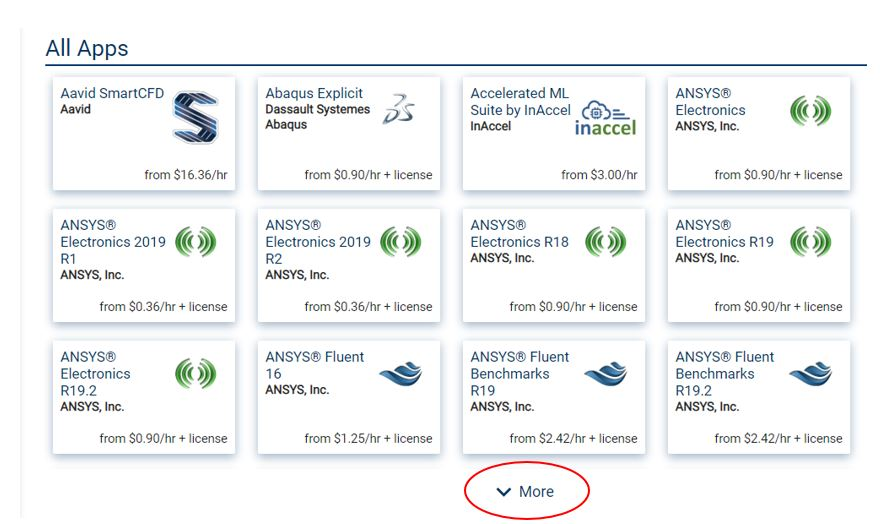

2. A splash window will open. Select the OpenFOAM GUI option as shown below:

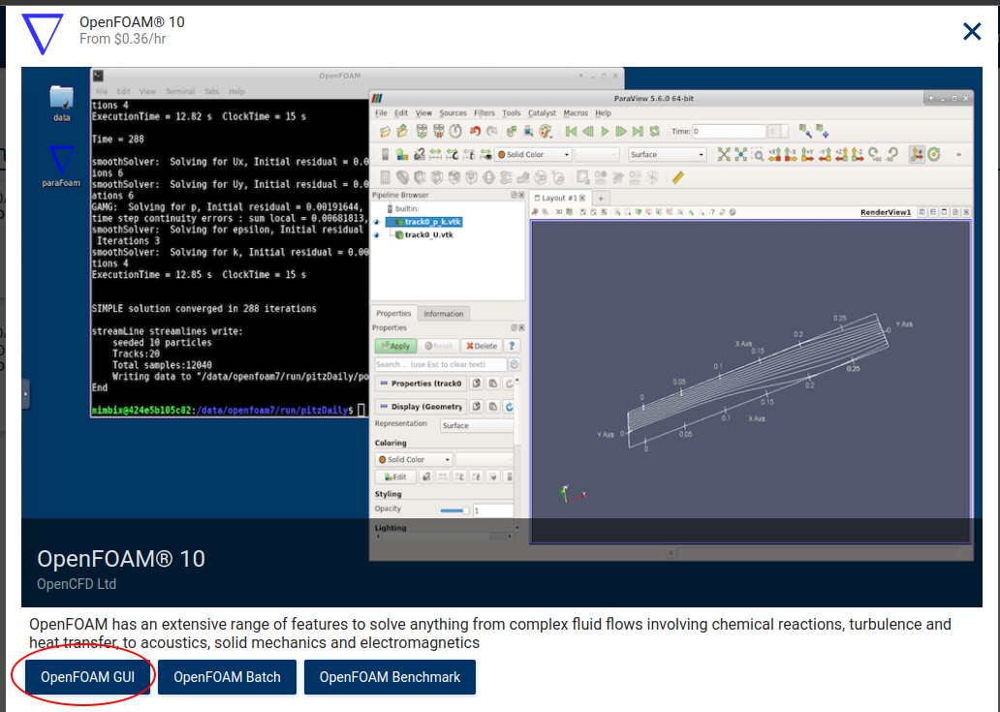

## UNDER GENERAL TAB

1. Under Machine type when you click on the caret on the right, you can
select the type of machine you want to run your job on. The decision on
machine type selection is based on the size and complexity of your model
and cost associated with the machine type (some machines will have higher
RAM, others will only run the job on single CPU, others will have better
graphics and therefore higher cost, etc).

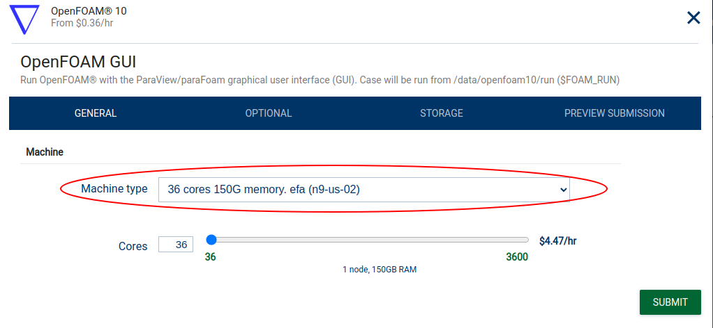

**NOTE**: When running interactive based applications, you’ll find that
selecting an NC9 or any NC* machine types should offer significant visual
performance over not selecting an NC machine type. By selecting an NC
machine, this places a GPU on your head-node, and offers better visual
performance. Another thing to keep in mind, is that when running
interactively you can use a web-browser, or in some cases for large models
or you might consider using RealVNC.

2. Select the number of cores:

The machine type you selected in the previous step, will dictate the
increment in the number of cores that you can choose/select. For a very
simple and small model, you can leave default selection, which in this case
would be “36” or move the scroll bar to the desired number of cores or
simply type over “36” the number of cores you wish to run your job on (we
left it default in this case):

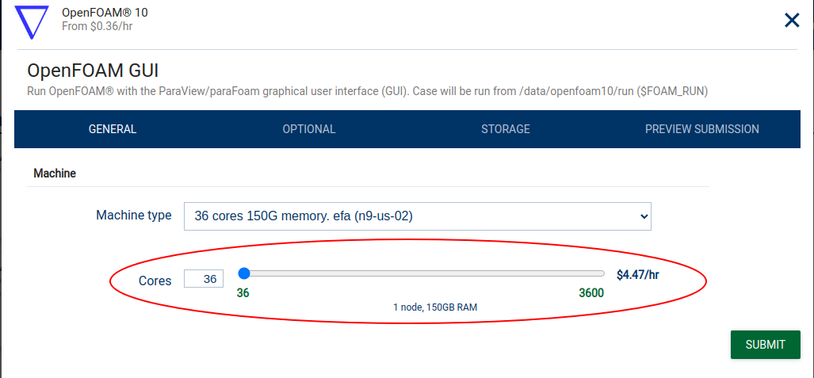

**NOTE**: Do not confuse the number of cores with the number of nodes (nodes represent the number of increment of cores that you selected. In the example above, 1 node represents 36 cores, 2 nodes correspond to 72 cores).

## UNDER OPTIONAL TAB

1. Assign a JOB LABEL (give a name that will help you keep track on your running jobs). For example, Motor Bike as shown below:

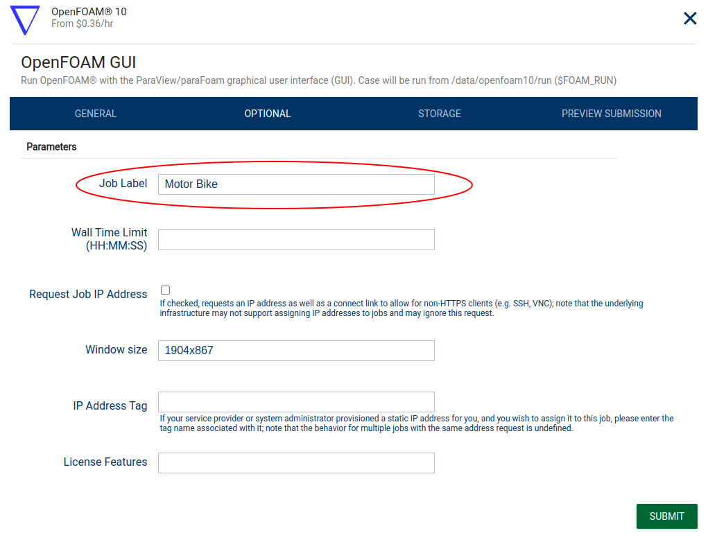

2. Leave blank the wall time limit and the IP address. The Window size needs to be kept as default.  Do not enter an Elastic License Server ID unless you use an elastic license on a designated server.

## UNDER STORAGE TAB

Select vault type: Default vault is “Elastic_File”


The “Elastic_File” vault is recommended for small to medium size jobs, such as Icepak projects, simple linear Mechanical Analysis projects, some HFSS and simple Fluent projects (not multi-phase). For any complex and computationally heavy jobs, and where partitioning the job over number of cores becomes challenging, the Performance_SSD vault is strongly recommended. The Performance_SSD vault can be found in the drop-down under “Select Vault” tab (NOTE: requires subscription and extra monthly payment to have access to Performance_SSD vault).

Before submitting your job for running, you can preview your settings under the PREVIEW SUBMISSION tab.

Start OpenFOAM on Nimbix by clicking on the SUBMIT button on the bottom-right of the splash window/screen.

Access OpenFOAM terminal by clicking on the preview window in your Dashboard. A new tab/browser window will open.

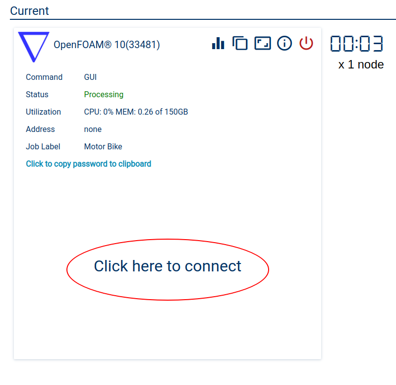

**Note**: A new directory (/openfoam10/run) is created in your data folder the first time you use OpenFOAM. Copy your OpenFOAM case directory (files can be created prior to analysis to save time and cost) in the /data/openfoam10/run directory.

## Start Your OpenFOAM Project – Preprocess and Meshing

1. Using Linux commands, navigate to the project directory that contains the required OpenFOAM directories and files (here we have already copied the simplefoam motorbike example to the run directory and added the geometry info to the constant/geometry).

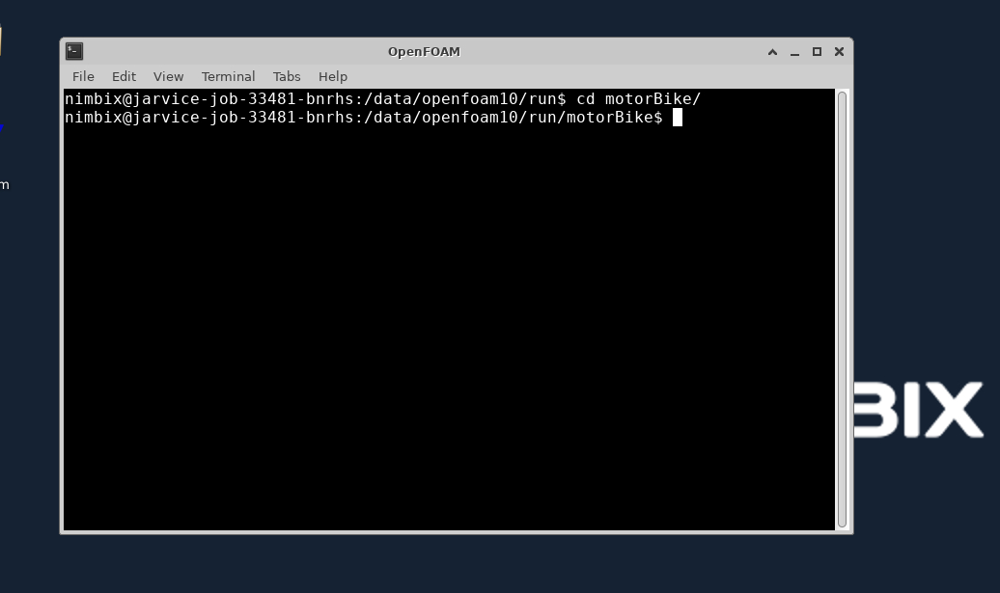

**NOTE**: At a minimum the case directory shall contain the 0/, constant/ and system/ folders. The 0/ folder contains initial values for pressure and velocity, constant/ folder contains the geometry info and properties that remain constant during analysis such as material properties, and the system/ folder contains the command and solution dictionaries.

2. Extract features of your geometry using surfaceFeatures: type `surfaceFeatures` in the Linux command window and examine the output in the command window paying close attention to error and warning messages.

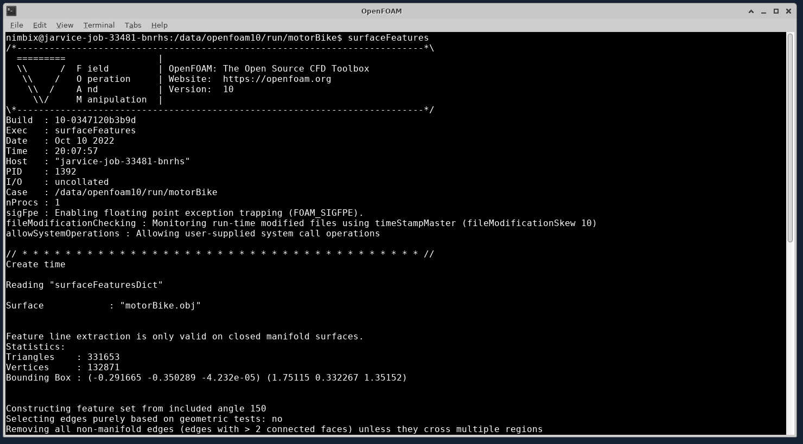

3. Build the containing mesh that goes around the motorbike using the blockMesh: type `blockMesh` in the Linux command window and keep and examine the mesher output in the command window paying close attention to error and warning messages.

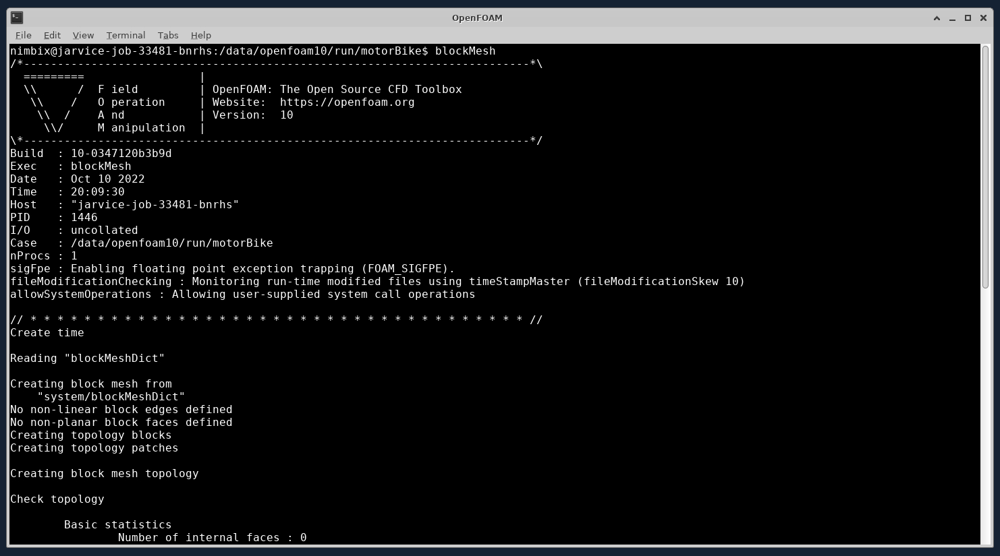

4. Decompose the geometry into 36 regions using decomposePar (here we have already altered the tutorial's decomposeParDict file for use with 36 cores): type `decomposePar -copyZero` in the Linux command window and examine the output in the command window paying close attention to error and warning messages.

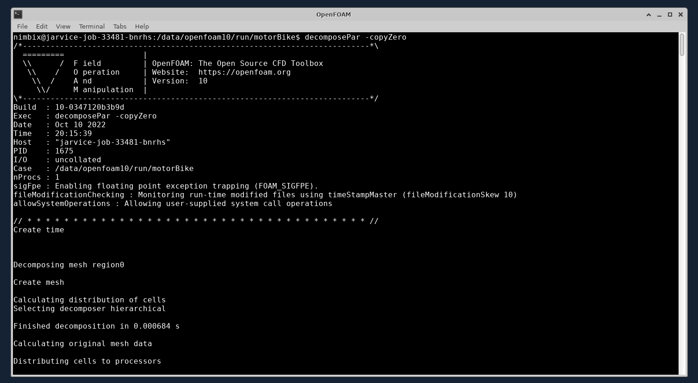

5. Mesh your geometry using snappyHexMesh:
```bash
foamJob -s -p snappyHexMesh -overwrite
```
in the Linux command window and keep and examine the mesher output in the command window paying close attention to error and warning messages.

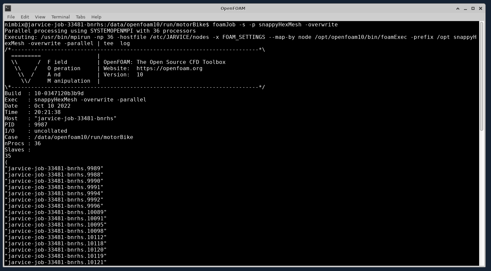

**NOTE**: blockMesh is the OpenFOAM built-in meshing engine. Several commercial FEM software meshers can be used to mesh your geometry and can be imported into OpenFOAM. FluentMeshToFoam Converts a Fluent mesh (in ASCII format) to foam format including multiple region and region boundary. It is necessary to have most of the required files for the simulation within the case directory to create the OpenFOAM mesh. The three main directories (0/, constant/ and system/) and their files are required to run blockMesh. Otherwise, it is also possible to use a solved case as a dummy file to run blockMesh.

Mesh is created in the /data/openfoam10/run/motorBike/constant/polymesh directory:

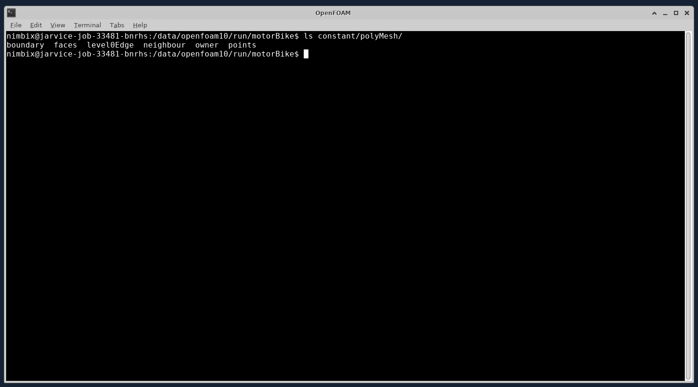

## Inspect Mesh in Graphic Window (optional)

1. In the motorBike directory, run the command
```bash
touch CFD.foam
```
to create an empty file for paraview to load.

2. Start ParaView from your desktop. ParaView is a pre and post processing software that can be used to view OpenFOAM files.

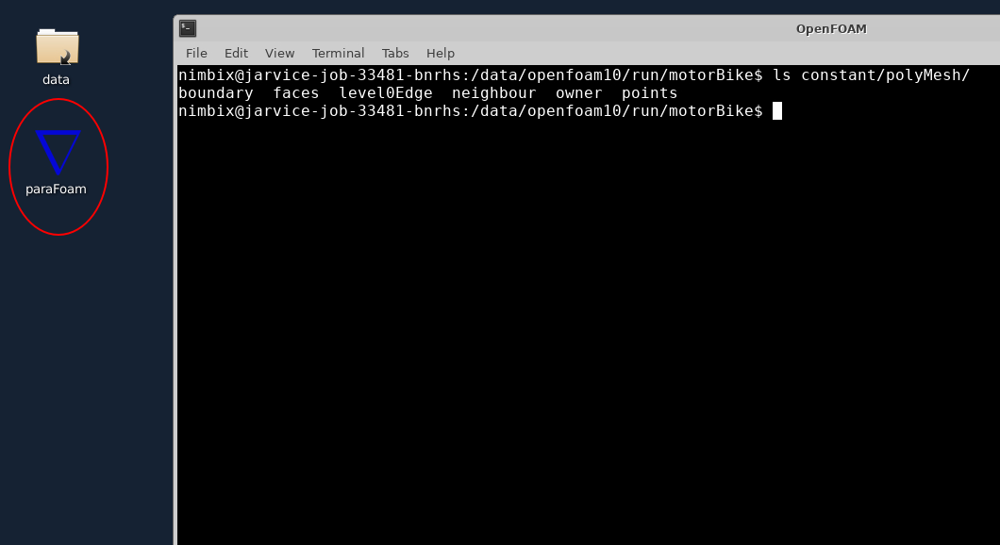

3. Open the file `CFD.foam`.

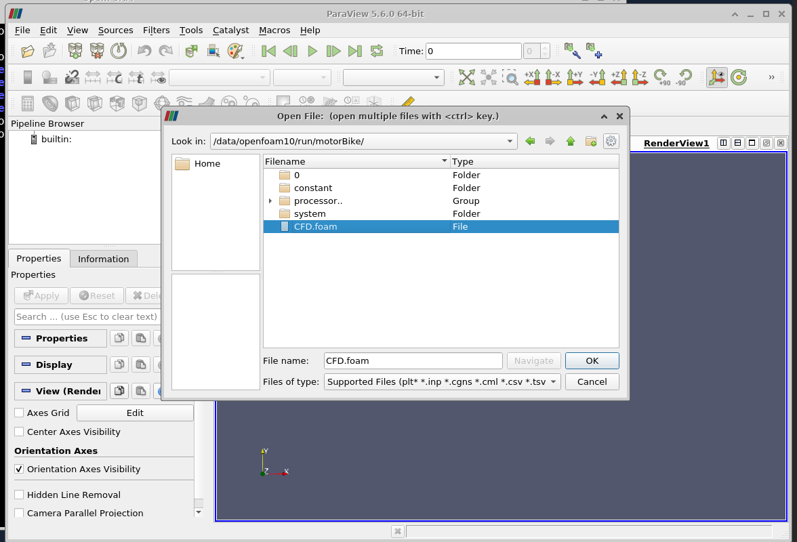

4. Click on the *eye* to make the mesh visable, click on change *casetype* from *Reconstructed Case* to *Decomposed Case*, and hit apply to have the changes take effect.

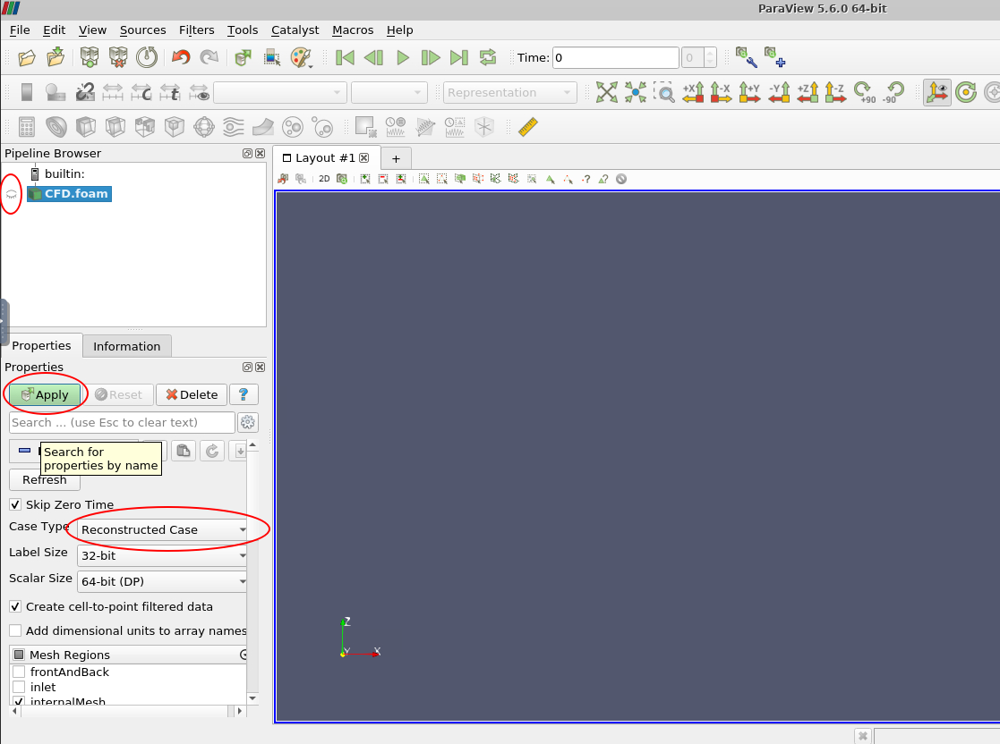

5. Select the `Y+` viewing angle, apply the `slice` filter, set the plane to `camera normal`, deselect show plane, and finally hit apply to show the motorbike.

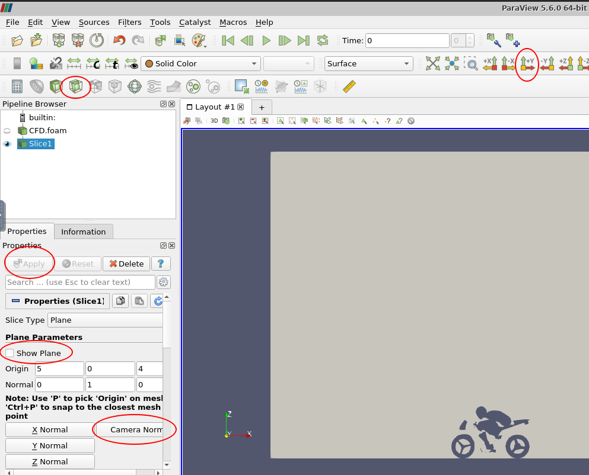

**NOTE**: The command checkMesh (as always, you need to be in the case directory to execute the command correctly) will also check the validity of your mesh but will not display it in a graphical window.

## Run OpenFOAM (Solver) and Post Process

Switch to OpenFOAM command window. Start the solver from the command prompt using the foamJob utility by typing:
```bash
foamJob -s -p simpleFoam
```

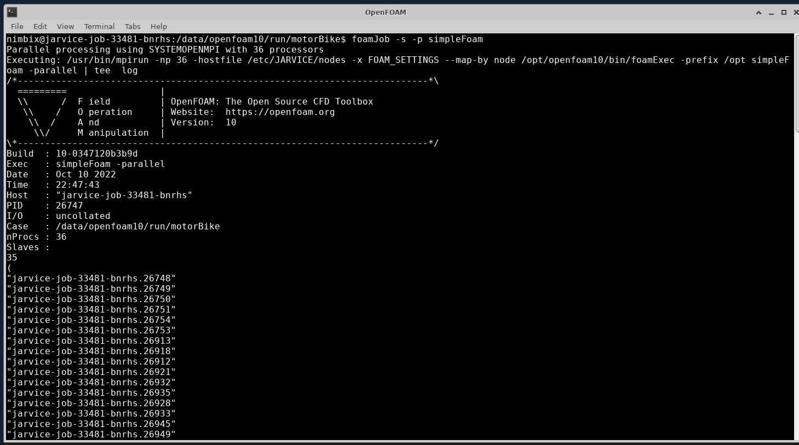

**NOTE**: Depending on the problem set-up you will use different solvers for different solution (set up in the fvSolution file in the system/ directory). In this example a steady state incompressible solver is used. Several solvers can be used (icoFoam, laplacianFoam, etc.) depending on your problem set-up.

Inspect the output file and analyze any warnings or errors.

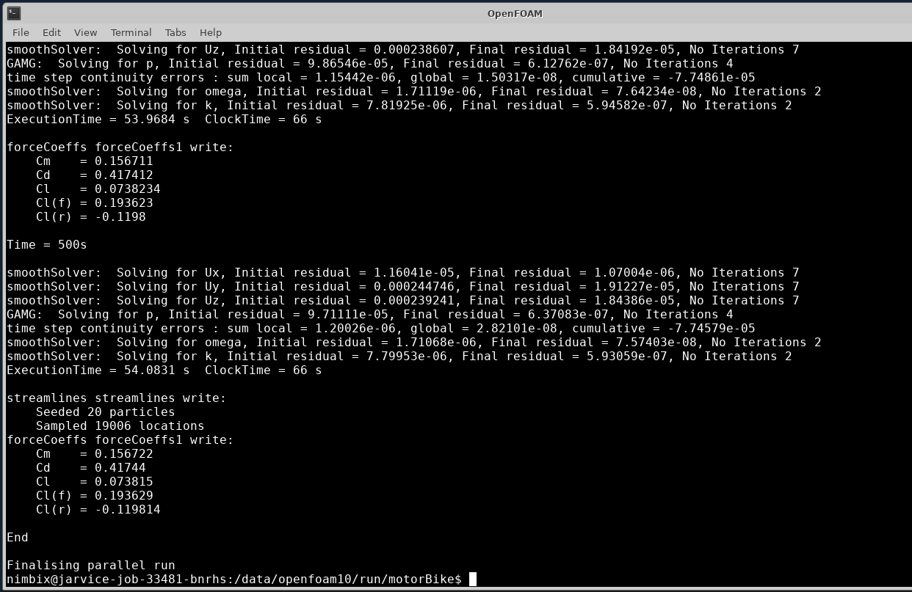

## POST PROCESS

View your solution using ParaView using the same steps/procedure outlined in the previous paragraph. Open the solution files from the newly created solution folders post analysis.

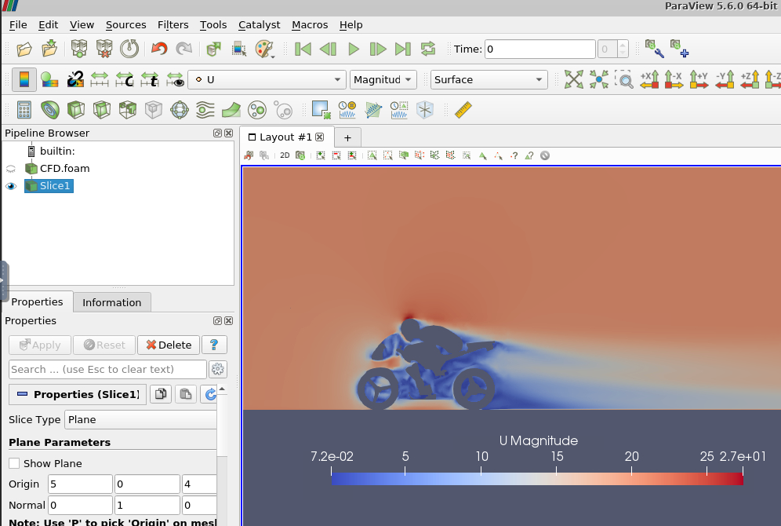
